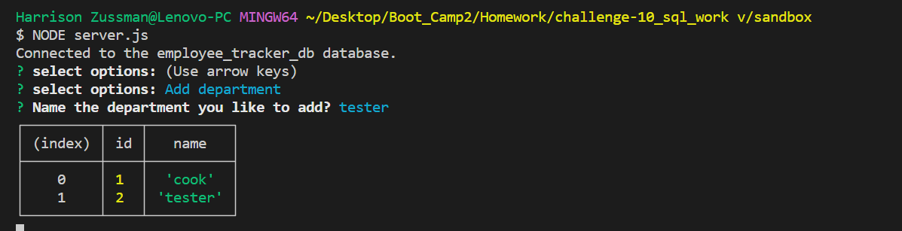
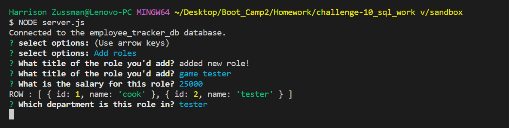
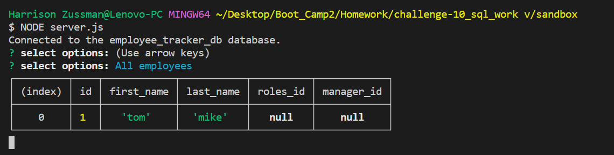
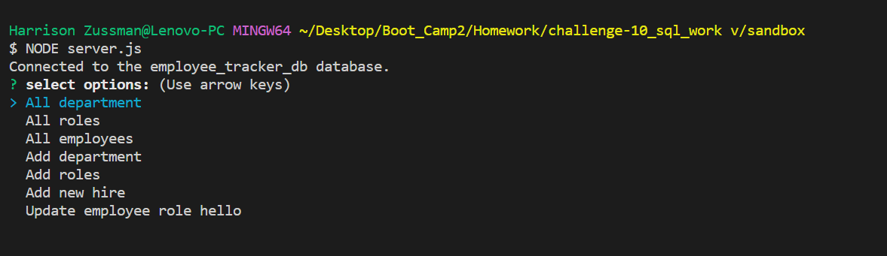
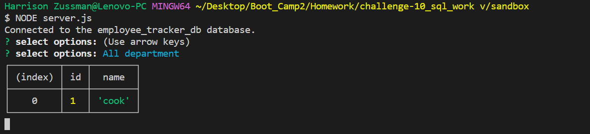
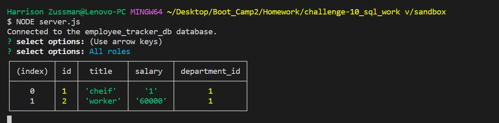
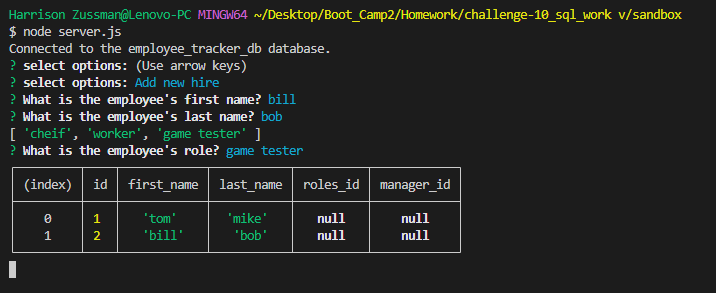

# <Title>
Employee_DataBase

## Desciption

The challenge for this assignment is to use a combination of inquirer and mysql2. inquirer collect the answer from the question on (server.js). mysql2 takes those answers and puts them on (MySQL Workbench)

## Installation
you need the do npm install inquirer then npm install mysql to get the npm. for the database copy and paste (./db/schema.sql) into (MySQL Workbench) so you now have the chart. open the terminal and type npm run seed to fill out the chart once all that is done  in the terminal type node server.js and answer the question to add things to the chart

## usage
the usage is to keep track of you employees information.

## Features
myspl2
inquirer

## screen shoot

## video

